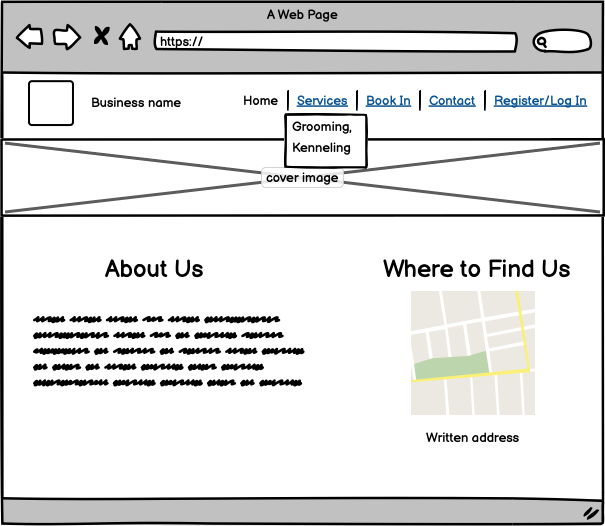
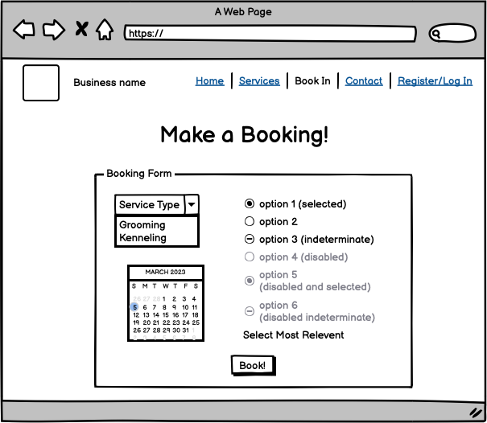
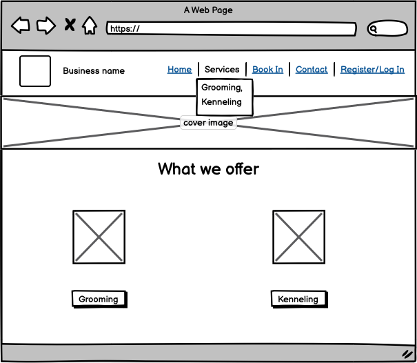
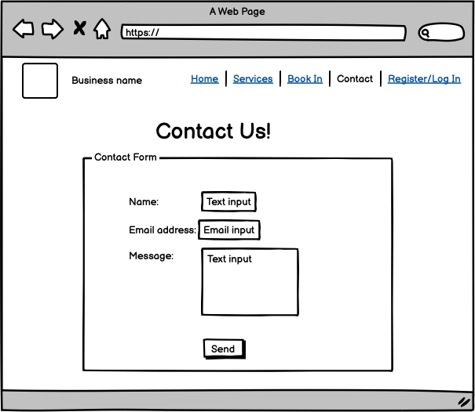
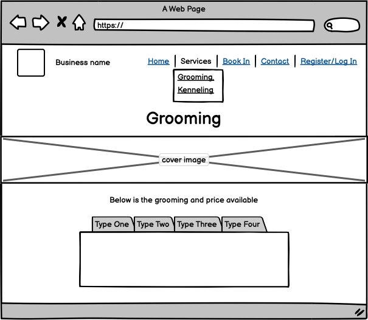
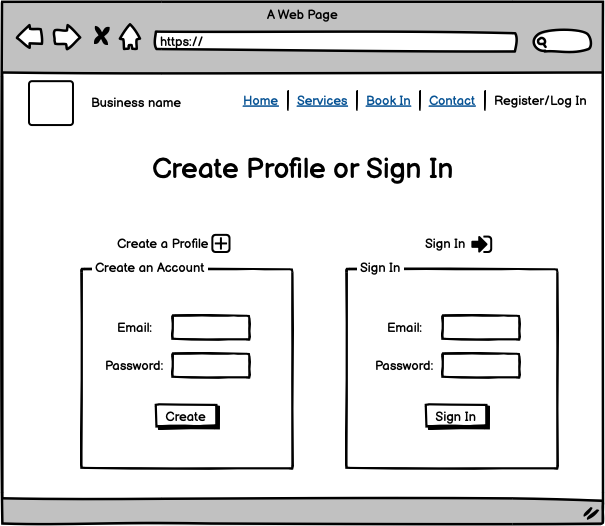
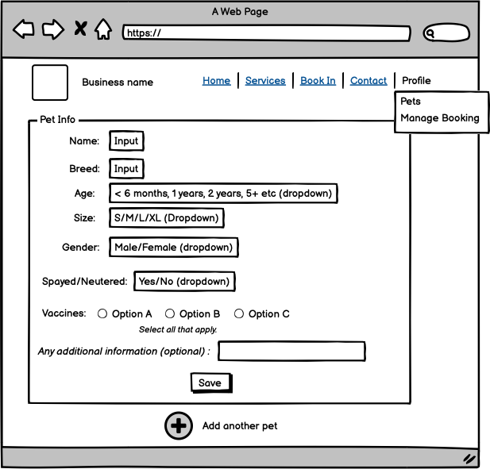
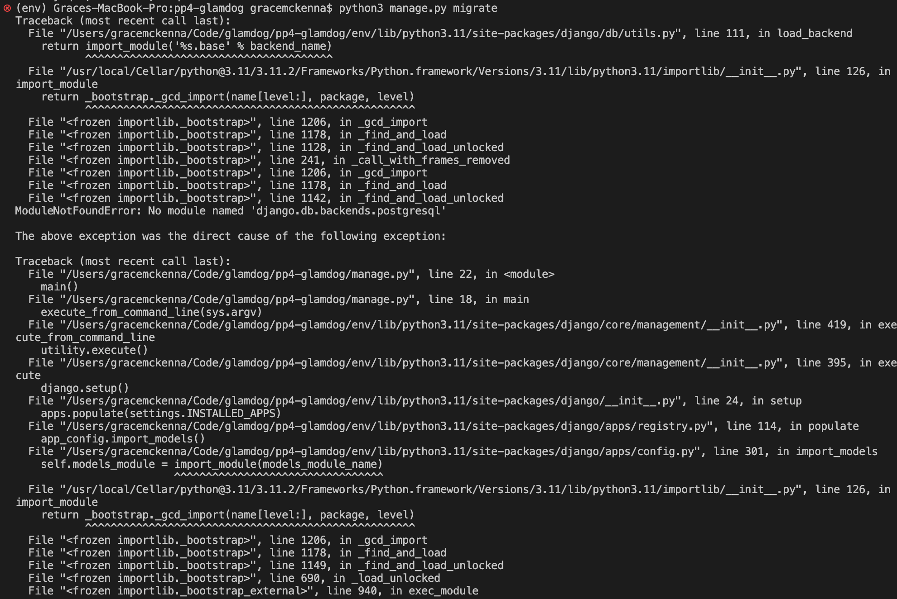
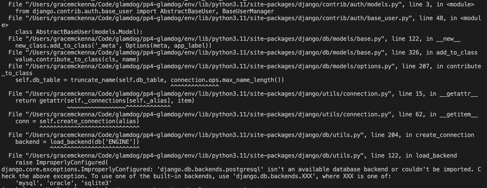
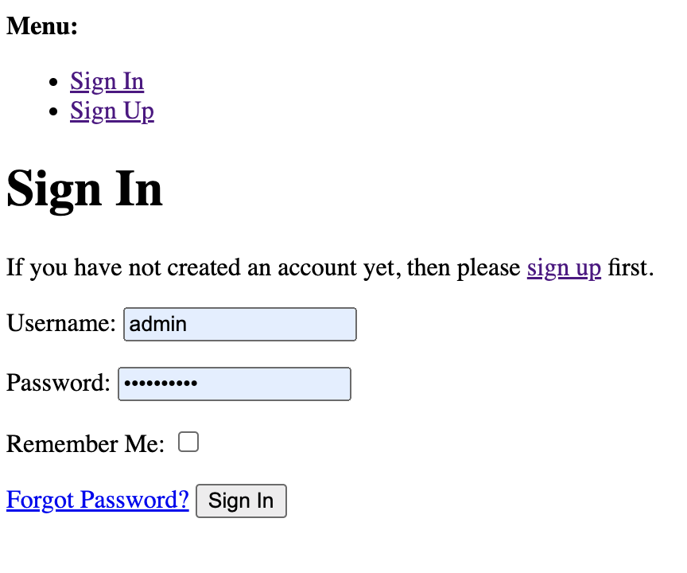

 

# Table of Contents

- [Table of Contents](#table-of-contents)
- [Site Overview](#site-overview)
  - [Goal](#goal)
  - [Technologies used](#technologies-used)
- [UX](#ux)
  - [Target Audience](#target-audience)
  - [Wireframes](#wireframes)
- [Features](#features)
  - [Existing Features](#existing-features)
  - [Future Features](#future-features)
- [Design](#design)
- [Testing](#testing)
  - [Bugs](#bugs)
  - [Known Issues](#known-issues)
- [Deployment](#deployment)
  - [Deployment to Heroku](#deployment-to-heroku)
  - [How to Fork](#how-to-fork)
- [Credits](#credits)
  - [Code](#code)
    - [Version Control](#version-control)
- [Acknowledgments](#acknowledgments)
  

# Site Overview
Deployed Site: 

## Goal

## Technologies used

- [Python](https://www.python.org/) for the main game-play.
- [GitHub](https://github.com/) as a remote repository.
- [Heroku](https://heroku.com) to deploy the website.
- [Visual Studio Code](https://code.visualstudio.com/) as a local IDE & repository.

# UX
## Target Audience

## Wireframes

           
Initial Project Wireframes

           

           
Base Website

          
           
          
           
          
           
          
           
          
           
          
          

          

          

          
Profile Pages

        

          
           
          
           
          
           
          
      

# Features

## Existing Features

## Future Features

# Design

# Testing

## Bugs

Bug | Status | Fix | Images of bug
----|--------|-----|--------------
Unable to migrate when connecting elephantsql database to project | FIXED | Had to manually install zlib onto mac, cloned the project to a new folder and created a new venv. | 
CSS not loading for default Django templates | Unresolved |  |
## Known Issues

# Deployment 
## Deployment to Heroku
1. Go to [Heroku](https://dashboard.heroku.com/apps)
2. Go to 'New' and select 'Create a new app'
3. Input your app name and create app.
4. Navigate to 'Settings'
5. Install the needed buildpacks. Select Python and install and then node.js and install and then click save. They must be in this order.
6. Navigate to the 'Deploy' section. 
7. Connect to GitHub, search for your repo and confirm. 
8. Choose branch to deploy.
9. Your app should now be available to see. You can choose whether to have your app automatically redeploy with every push or to keep it manual. 

## How to Fork
1. Login/signup to [GitHub](https://github.com/).
2. Locate the relevant repository - in this case [gracemcken/the-cave](https://github.com/gracemcken/the-cave)
3. Click on the 'Fork' button in the upper left.
4. Your forked version of this repo will be generated!
# Credits
## Code
- Integrating Tailwind CSS with Django video [here](https://www.youtube.com/watch?v=lsQVukhwpqQ) & source code adapted found [here](https://github.com/codingforentrepreneurs/django-tailwindcss)
- Form CSS was altered from [this](https://tailwindcomponents.com/component/sb-admin-2-forgot-password-page) source code.

### Version Control
*   Git was used as the version control software. Commands such as git add ., git status, git commit and git push were used to add, save, stage and push the code to the GitHub repository where the source code is stored.

# Acknowledgments

